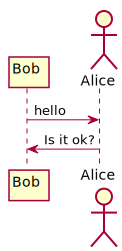

# remark-uml

> ⚠️ Since PlantUML is written in Java, this module can't currently be used on the browser.
> Investigations are currently being made to try to compile PlantUML to WASM and run it anywhere.

**remark** plugin to compile PlantUML syntax to either images or ASCII art.

## Install

With npm:
```
npm install remark-uml
```

With yarn:
```
yarn add remark-uml
```

## Use

Say we have the following file, `example.md`:

```md
# This is my PlantUML diagram

@startuml
participant Bob
actor Alice

Bob -> Alice : hello
Alice -> Bob : Is it ok?
@enduml

**Pretty neat, huh?**
```

And our script, `example.js`, looks as follows:

```js
const fs = require('fs');
const remark = require('remark');
const uml = require('remark-uml');

remark()
  .use(uml, { format: 'txt' })
  .process(fs.readFileSync('example.md'))
  .then(output => console.log(output.toString()))
```

Now, running `node example` yields:

~~~md
# This is my PlantUML diagram

```uml
                      ,-.  
                      `-'  
                      /|\  
     ,---.             |   
     |Bob|            / \  
     `-+-'           Alice 
       |    hello      |   
       |-------------->|   
       |               |   
       |  Is it ok?    |   
       |<--------------|   
     ,-+-.           Alice 
     |Bob|            ,-.  
     `---'            `-'  
                      /|\  
                       |   
                      / \  
```

**Pretty neat, huh?**
~~~

Note that all the options can also be overridden per diagram by passing a JSON immediately after `@startuml`.
For example, if you want to generate some diagrams as an image and others as an ASCII art, you can do it in this way:

```md
**SVG:**

@startuml{"format": "svg"}
participant Bob
actor Alice

Bob -> Alice : hello
Alice -> Bob : Is it ok?
@enduml

**PNG:**

@startuml{"format": "png"}
participant Bob
actor Alice

Bob -> Alice : hello
Alice -> Bob : Is it ok?
@enduml

**ASCII:**

@startuml{"format": "txt"}
participant Bob
actor Alice

Bob -> Alice : hello
Alice -> Bob : Is it ok?
@enduml

**Unicode:**

@startuml{"format": "utxt"}
participant Bob
actor Alice

Bob -> Alice : hello
Alice -> Bob : Is it ok?
@enduml
```

As a result, you will get the following output:

_Images are actually inlined in the output, but have been moved to external
images because some websites don't render inline images in markdown files_

---

**SVG:**



**PNG:**


**ASCII:**

```
                      ,-.  
                      `-'  
                      /|\  
     ,---.             |   
     |Bob|            / \  
     `-+-'           Alice 
       |    hello      |   
       |-------------->|   
       |               |   
       |  Is it ok?    |   
       |<--------------|   
     ,-+-.           Alice 
     |Bob|            ,-.  
     `---'            `-'  
                      /|\  
                       |   
                      / \  
```

**Unicode:**

```
                      ┌─┐  
                      ║"│  
                      └┬┘  
                      ┌┼┐  
     ┌───┐             │   
     │Bob│            ┌┴┐  
     └─┬─┘           Alice 
       │    hello      │   
       │──────────────>│   
       │               │   
       │  Is it ok?    │   
       │<──────────────│   
     ┌─┴─┐           Alice 
     │Bob│            ┌─┐  
     └───┘            ║"│  
                      └┬┘  
                      ┌┼┐  
                       │   
                      ┌┴┐  
```

---

## API

### `remark().use(uml[, options])`

##### `options`

###### `options.format`

The output format of the UML diagrams.

Possible values are:
- `svg`: Inline SVG;
- `png`: Inline base64-encoded PNG;
- `txt`: code block containing the diagram as ASCII art;
- `utxt`: same as `txt`, but using Unicode characters to make the output prettier.

Default value is `svg`.

###### `options.optimize`

Whether to optimize or not the output. Currently only used if `options.format` is set to `svg`.

Possible values are:
- `true`: Optimize using default options (i.e. `{ multipass: true }`);
- `Object`: Optimize using custom options. These options are passed directly to SVGO;
- `false | null`: Disable optimizations (not recommended).

Default value is `true`.

###### `options.languageName`

The language name to give to the output code block. Used only if `options.format` is set to `txt` or `utxt`.

It can be any `string`, or a falsy value to disable the language name and make the code block generic.

Default value is `uml`.

## License

[MIT](LICENSE)
